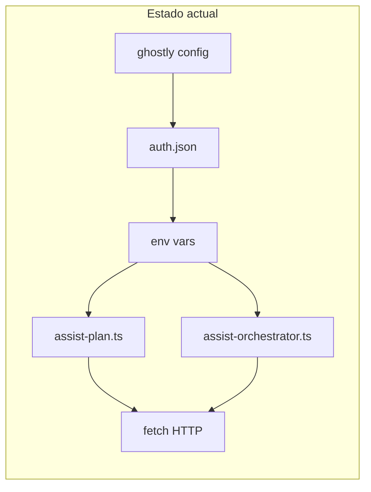
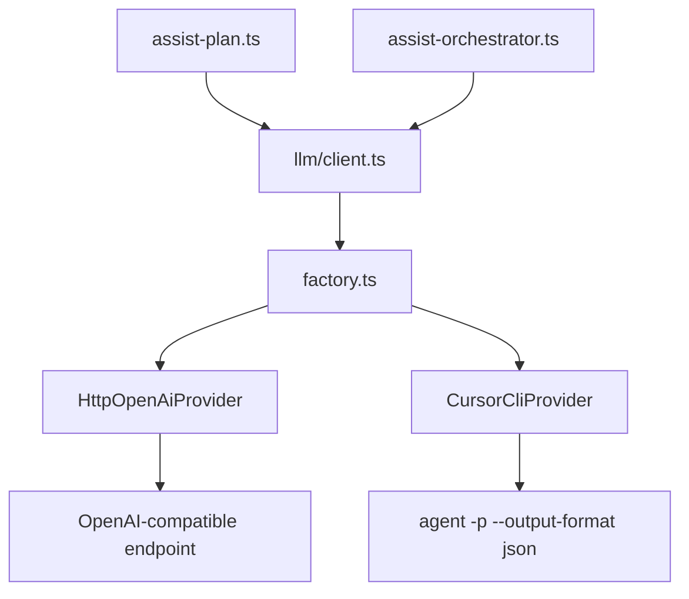
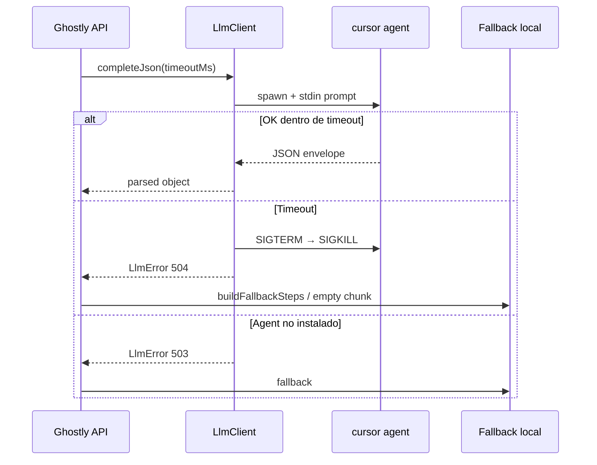

# Integración de Cursor CLI como proveedor de IA en Ghostly

> Documento de arquitectura — refactor para soportar proveedores HTTP (API Key) y Cursor CLI (auth local).

## Resumen ejecutivo

Ghostly hoy invoca modelos de IA mediante **peticiones HTTP directas** al formato OpenAI Chat Completions. Esa lógica está **duplicada** en dos servicios del API y acoplada a variables de entorno con nombres inconsistentes respecto al CLI.

La propuesta es extraer un módulo `llm/` con un contrato único (`LlmProvider`) y dos implementaciones:

| Proveedor | ID | Autenticación | Cuándo usarlo |
|-----------|-----|---------------|---------------|
| HTTP OpenAI-compatible | `http` | `ASSIST_LLM_API_KEY` + `ASSIST_LLM_API_URL` | Ollama, OpenRouter, Azure, OpenAI, Anthropic vía proxy |
| Cursor Agent CLI | `cursor-cli` | `agent login` o `CURSOR_API_KEY` | Usuario con Cursor instalado que no quiere gestionar API keys de terceros |

**Recomendación ponytail:** para el caso “auth local de Cursor”, usar el binario `agent` en modo headless (`-p --output-format json`). Es el camino más simple, sin dependencia npm nueva, y reutiliza la sesión del usuario. El SDK `@cursor/sdk` queda como evolución si necesitás streaming, reanudar sesiones o observabilidad avanzada.

---

## Estado actual del código

### Puntos de integración LLM

| Archivo | Función | Rol |
|---------|---------|------|
| `apps/api/src/services/assist-plan.ts` | `callAssistLlm()` | Genera planes E2E desde un goal |
| `apps/api/src/services/assist-orchestrator.ts` | `callLlmJson()` | Strategist + Healer en Assist V2 |

Ambos repiten el mismo patrón:

```ts
function llmConfig() {
  return {
    endpoint: process.env.ASSIST_LLM_API_URL?.trim() || "",
    apiKey: process.env.ASSIST_LLM_API_KEY?.trim() || "",
    model: process.env.ASSIST_LLM_MODEL?.trim() || "assist-fallback-v1",
  };
}
// → fetch POST con Authorization: Bearer, response_format: json_object
```

### Configuración en el CLI

| Archivo | Qué hace |
|---------|----------|
| `packages/cli/src/lib/auth.ts` | Persiste `~/.ghostly/auth.json` y mapea a env vars |
| `packages/cli/src/commands/config.ts` | Wizard interactivo de proveedor/modelo/apiKey/baseUrl |
| `packages/cli/src/commands/up.ts` | Inyecta env al proceso del API y advierte si falta LLM |

### Deuda técnica detectada (corregir en el refactor)

1. **Desalineación de variables:** el CLI escribe `LLM_BASE_URL` pero el API lee `ASSIST_LLM_API_URL`. Hoy `ghostly config --llm-base-url` probablemente no llega al backend.
2. **`LLM_PROVIDER` no se consume:** se guarda en auth y se exporta como env, pero el API ignora el proveedor y solo mira endpoint + apiKey.
3. **Lógica duplicada:** parsing de `choices[0].message.content`, `extractJsonBlock`, timeouts y errores están copiados en dos archivos.
4. **Health check incompleto:** `/v1/ping` solo reporta `assistConfigured` si hay API key, no si Cursor CLI está disponible.



---

## 1. Análisis de impacto

### Objetivo del diseño

Un solo punto de entrada para todas las llamadas LLM del backend, con selección de proveedor por configuración y fallbacks predecibles.

### Estructura de carpetas propuesta

```
apps/api/src/llm/
├── types.ts              # Contratos e interfaces
├── config.ts             # Resolución unificada de env + auth
├── extract-json.ts       # extractJsonBlock + parseAssistantContent (compartido)
├── client.ts             # Facade: completeJson(system, user, opts)
├── factory.ts            # createLlmProvider(config)
├── errors.ts             # LlmError con códigos HTTP
└── providers/
    ├── http-openai.ts    # Proveedor actual (fetch)
    └── cursor-cli.ts     # Nuevo: subprocess agent
```

Opcionalmente, si el CLI necesita validar el proveedor antes de `up`, mover `types.ts` + `cursor-cli.ts` a `packages/llm` como workspace package. Para la primera iteración, mantenerlo en `apps/api` es suficiente.

### Patrón: Strategy + Factory

```ts
// types.ts
export type LlmProviderId = "http" | "cursor-cli";

export type LlmMessage = { role: "system" | "user"; content: string };

export type LlmCompleteRequest = {
  messages: LlmMessage[];
  model?: string;
  timeoutMs: number;
  jsonMode?: boolean; // default true en Ghostly
  label?: string;     // para logs: "strategist", "healer", "assist-plan"
};

export type LlmCompleteResult = {
  rawText: string;
  usage?: Record<string, unknown>;
  provider: LlmProviderId;
  elapsedMs: number;
};

export interface LlmProvider {
  readonly id: LlmProviderId;
  isAvailable(): Promise<boolean>;
  complete(req: LlmCompleteRequest): Promise<LlmCompleteResult>;
}
```

```ts
// factory.ts
export function createLlmProvider(config: ResolvedLlmConfig): LlmProvider | null {
  switch (config.provider) {
    case "cursor-cli":
      return new CursorCliProvider(config);
    case "http":
    default:
      return config.endpoint && config.apiKey
        ? new HttpOpenAiProvider(config)
        : null;
  }
}
```

### Resolución de configuración unificada

```ts
// config.ts
export type ResolvedLlmConfig = {
  provider: LlmProviderId;
  model: string;
  endpoint: string;
  apiKey: string;
  cursorAgentBin: string;
  cursorWorkspace: string;
  defaultTimeoutMs: number;
};

export function resolveLlmConfig(): ResolvedLlmConfig {
  const providerRaw =
    process.env.ASSIST_LLM_PROVIDER?.trim() ||
    process.env.LLM_PROVIDER?.trim() ||
    "http";

  const provider: LlmProviderId =
    providerRaw === "cursor-cli" || providerRaw === "cursor" ? "cursor-cli" : "http";

  return {
    provider,
    model: process.env.ASSIST_LLM_MODEL?.trim() || "composer-2.5",
    // Unificar nombres: aceptar ambos durante migración
    endpoint:
      process.env.ASSIST_LLM_API_URL?.trim() ||
      process.env.LLM_BASE_URL?.trim() ||
      "",
    apiKey:
      process.env.ASSIST_LLM_API_KEY?.trim() ||
      process.env.OPENAI_API_KEY?.trim() ||
      "",
    cursorAgentBin:
      process.env.CURSOR_AGENT_BIN?.trim() || "agent",
    cursorWorkspace:
      process.env.CURSOR_AGENT_WORKSPACE?.trim() || process.cwd(),
    defaultTimeoutMs: Number(process.env.ASSIST_LLM_TIMEOUT_MS) || 45_000,
  };
}
```

### Cambios por capa

| Capa | Cambio |
|------|--------|
| `assist-plan.ts` | Reemplazar `callAssistLlm` por `llmClient.completeJson(...)` |
| `assist-orchestrator.ts` | Reemplazar `callLlmJson` por el mismo cliente |
| `packages/cli/src/lib/auth.ts` | Mapear `baseUrl` → `ASSIST_LLM_API_URL`; `provider: "cursor-cli"` → sin apiKey obligatoria |
| `packages/cli/src/commands/config.ts` | Ofrecer `cursor-cli` como opción; si se elige, omitir apiKey |
| `packages/cli/src/commands/up.ts` | Advertir según proveedor (key vs `agent status`) |
| `apps/api/src/app.ts` | Extender `/v1/ping` con `llmProvider` y `llmAvailable` |

### Diagrama objetivo



### Criterio de disponibilidad por proveedor

| Proveedor | `isAvailable()` |
|-----------|-----------------|
| `http` | `endpoint` y `apiKey` no vacíos |
| `cursor-cli` | binario encontrado en PATH **y** (`agent status` OK **o** `CURSOR_API_KEY` presente) |

Si ningún proveedor está disponible → comportamiento actual: fallback local en plan, objeto vacío en orchestrator.

---

## 2. Propuesta de driver para Cursor CLI

### Binario correcto

En Windows coexisten dos CLIs distintos:

| Comando | Qué es |
|---------|--------|
| `cursor` / `cursor.cmd` | Editor VS Code-like (abrir archivos, diff, MCP) |
| `agent` / `cursor-agent.cmd` | **Cursor Agent CLI** — el que necesitamos |

Instalación típica Windows: `%LOCALAPPDATA%\cursor-agent\cursor-agent.cmd`

### Modo headless recomendado

Verificado en entorno local:

```bash
agent -p --output-format json --trust --mode ask "Responde SOLO con JSON: {\"ok\":true}"
```

Salida (una línea JSON):

```json
{
  "type": "result",
  "subtype": "success",
  "is_error": false,
  "result": "{\"ok\":true}",
  "session_id": "...",
  "usage": { "inputTokens": 19195, "outputTokens": 57 }
}
```

Flags clave:

| Flag | Propósito |
|------|-----------|
| `-p` / `--print` | Modo script, sin TUI interactiva |
| `--output-format json` | Respuesta parseable |
| `--trust` | Confía el workspace sin prompt (headless) |
| `--mode ask` | Solo lectura — **no edita archivos ni ejecuta shell** (ideal para planner/strategist) |
| `--model <id>` | Modelo explícito (requerido para comportamiento predecible) |
| `--workspace <path>` | CWD del agente |

**No pasar el prompt como argumento posicional** si el contenido incluye metadatos de usuario (inyección shell). Usar archivo temporal o stdin.

### Implementación TypeScript

```ts
// apps/api/src/llm/providers/cursor-cli.ts
import { spawn } from "node:child_process";
import { mkdtemp, writeFile, rm } from "node:fs/promises";
import { tmpdir } from "node:os";
import { join } from "node:path";
import { execFile } from "node:child_process";
import { promisify } from "node:util";
import type { LlmCompleteRequest, LlmCompleteResult, LlmProvider } from "../types.js";
import type { ResolvedLlmConfig } from "../config.js";
import { LlmError } from "../errors.js";

const execFileAsync = promisify(execFile);

type AgentJsonResult = {
  type?: string;
  subtype?: string;
  is_error?: boolean;
  result?: string;
  usage?: Record<string, unknown>;
  error?: string;
};

export class CursorCliProvider implements LlmProvider {
  readonly id = "cursor-cli" as const;

  constructor(private readonly config: ResolvedLlmConfig) {}

  async isAvailable(): Promise<boolean> {
    try {
      await execFileAsync(this.config.cursorAgentBin, ["--version"], {
        timeout: 5_000,
        windowsHide: true,
      });
    } catch {
      return false;
    }
    if (process.env.CURSOR_API_KEY?.trim()) return true;
    try {
      const { stdout } = await execFileAsync(
        this.config.cursorAgentBin,
        ["status"],
        { timeout: 8_000, windowsHide: true },
      );
      return /logged in|✓/i.test(stdout);
    } catch {
      return false;
    }
  }

  async complete(req: LlmCompleteRequest): Promise<LlmCompleteResult> {
    const startedAt = Date.now();
    const prompt = this.buildPrompt(req);
    const tmpDir = await mkdtemp(join(tmpdir(), "ghostly-llm-"));
    const promptFile = join(tmpDir, "prompt.txt");

    try {
      await writeFile(promptFile, prompt, "utf8");

      const args = [
        "-p",
        "--output-format", "json",
        "--trust",
        "--mode", "ask",
        "--workspace", this.config.cursorWorkspace,
      ];
      if (req.model ?? this.config.model) {
        args.push("--model", req.model ?? this.config.model);
      }

      const { stdout, stderr, exitCode } = await this.runAgent(args, promptFile, req.timeoutMs);

      if (exitCode !== 0) {
        throw new LlmError(
          `Cursor Agent terminó con código ${exitCode}: ${stderr.slice(0, 300)}`,
          502,
          "cursor-cli",
        );
      }

      const envelope = this.parseEnvelope(stdout);
      if (envelope.is_error || envelope.subtype === "error") {
        throw new LlmError(
          envelope.error ?? "Cursor Agent reportó error",
          502,
          "cursor-cli",
        );
      }

      const rawText = envelope.result?.trim() ?? "";
      if (!rawText) {
        throw new LlmError("Respuesta vacía de Cursor Agent", 502, "cursor-cli");
      }

      return {
        rawText,
        usage: envelope.usage,
        provider: "cursor-cli",
        elapsedMs: Date.now() - startedAt,
      };
    } finally {
      await rm(tmpDir, { recursive: true, force: true });
    }
  }

  private buildPrompt(req: LlmCompleteRequest): string {
    const parts = req.messages.map((m) =>
      m.role === "system" ? `## Sistema\n${m.content}` : `## Usuario\n${m.content}`,
    );
    if (req.jsonMode !== false) {
      parts.push("## Formato\nResponde ÚNICAMENTE con JSON válido. Sin markdown, sin texto extra.");
    }
    return parts.join("\n\n");
  }

  private parseEnvelope(stdout: string): AgentJsonResult {
    const line = stdout.trim().split("\n").filter(Boolean).at(-1) ?? "";
    try {
      return JSON.parse(line) as AgentJsonResult;
    } catch {
      throw new LlmError("No se pudo parsear la salida JSON del agent CLI", 502, "cursor-cli");
    }
  }

  private runAgent(
    args: string[],
    promptFile: string,
    timeoutMs: number,
  ): Promise<{ stdout: string; stderr: string; exitCode: number }> {
    return new Promise((resolve, reject) => {
      // ponytail: prompt por stdin evita límites de argv en Windows y shell injection
      const child = spawn(
        this.config.cursorAgentBin,
        args,
        {
          cwd: this.config.cursorWorkspace,
          env: { ...process.env },
          stdio: ["pipe", "pipe", "pipe"],
          windowsHide: true,
        },
      );

      let stdout = "";
      let stderr = "";
      let settled = false;

      const timer = setTimeout(() => {
        if (settled) return;
        settled = true;
        child.kill("SIGTERM");
        setTimeout(() => child.kill("SIGKILL"), 2_000).unref();
        reject(new LlmError("Timeout al consultar Cursor Agent", 504, "cursor-cli"));
      }, timeoutMs);

      child.stdout.on("data", (chunk) => { stdout += String(chunk); });
      child.stderr.on("data", (chunk) => { stderr += String(chunk); });

      child.on("error", (err) => {
        if (settled) return;
        settled = true;
        clearTimeout(timer);
        if ((err as NodeJS.ErrnoException).code === "ENOENT") {
          reject(new LlmError(
            `Cursor Agent no encontrado (${this.config.cursorAgentBin}). Instálalo o define CURSOR_AGENT_BIN.`,
            503,
            "cursor-cli",
          ));
        } else {
          reject(new LlmError(err.message, 502, "cursor-cli"));
        }
      });

      child.on("close", (code) => {
        if (settled) return;
        settled = true;
        clearTimeout(timer);
        resolve({ stdout, stderr, exitCode: code ?? 1 });
      });

      // Leer prompt desde archivo y escribir a stdin
      import("node:fs/promises").then(({ readFile }) =>
        readFile(promptFile, "utf8").then((text) => {
          child.stdin.write(text);
          child.stdin.end();
        }),
      ).catch(reject);
    });
  }
}
```

### Alternativas evaluadas

| Opción | Pros | Contras |
|--------|------|---------|
| **`agent -p --output-format json`** ✅ | Auth local, cero deps, probado | Latencia alta (~7–35s), un proceso por llamada |
| **`@cursor/sdk` `Agent.prompt()`** | Manejo de errores, dispose, streaming | Dependencia npm; auth local vía bridge igual necesita CLI instalado |
| **`agent acp` (JSON-RPC)** | Control fino, sesiones | Complejidad alta; bugs conocidos en MCP/permisos en ACP |

Para Assist V2 (muchas llamadas por run), considerar **pool de sesiones ACP** o SDK solo si la latencia del spawn se vuelve insostenible.

---

## 3. Refactorización del código

### Cliente facade compartido

```ts
// apps/api/src/llm/client.ts
import { createLlmProvider } from "./factory.js";
import { resolveLlmConfig } from "./config.js";
import { extractJsonBlock } from "./extract-json.js";
import type { LlmMessage } from "./types.js";

export type CompleteJsonOptions = {
  timeoutMs: number;
  label?: string;
  model?: string;
};

export async function completeJson(
  messages: LlmMessage[],
  opts: CompleteJsonOptions,
): Promise<Record<string, unknown>> {
  const config = resolveLlmConfig();
  const provider = createLlmProvider(config);
  if (!provider || !(await provider.isAvailable())) {
    return {};
  }

  const result = await provider.complete({
    messages,
    timeoutMs: opts.timeoutMs,
    label: opts.label,
    model: opts.model ?? config.model,
    jsonMode: true,
  });

  const parsed = JSON.parse(extractJsonBlock(result.rawText)) as unknown;
  return parsed && typeof parsed === "object" ? (parsed as Record<string, unknown>) : {};
}
```

### `assist-plan.ts` — antes y después

**Antes** (`callAssistLlm`, ~100 líneas con fetch duplicado):

```ts
async function callAssistLlm(goal, baseUrl, timeoutMs, retryHint?) {
  const config = llmConfig();
  if (!config.endpoint || !config.apiKey) {
    return { baseUrl, steps: buildFallbackSteps(goal), defaultTimeoutMs: 30_000 };
  }
  const response = await fetch(config.endpoint, { /* ... */ });
  // parse choices[0].message.content, extractJsonBlock, normalize...
}
```

**Después:**

```ts
import { completeJson } from "../llm/client.js";
import { resolveLlmConfig } from "../llm/config.js";
import { LlmError } from "../llm/errors.js";

async function callAssistLlm(
  goal: string,
  baseUrl: string,
  timeoutMs: number,
  retryHint?: string,
): Promise<unknown> {
  const config = resolveLlmConfig();
  const provider = createLlmProvider(config);

  if (!provider || !(await provider.isAvailable())) {
    logAssist("Usando fallback local (sin proveedor LLM configurado)", { baseUrl });
    return { baseUrl, steps: buildFallbackSteps(goal), defaultTimeoutMs: 30_000 };
  }

  try {
    const parsed = await completeJson(
      [
        { role: "system", content: SYSTEM_PROMPT },
        { role: "user", content: buildUserPrompt(baseUrl, goal, retryHint) },
      ],
      { timeoutMs, label: "assist-plan", model: config.model },
    );
    return normalizePlanCandidate(parsed, baseUrl) as RunInput;
  } catch (error) {
    if (error instanceof LlmError && error.status === 504) {
      throw new AssistPlanError("Timeout al generar plan asistido", 504);
    }
    throw new AssistPlanError("No se pudo generar plan asistido", 502);
  }
}
```

### `assist-orchestrator.ts` — después

```ts
import { completeJson } from "../llm/client.js";

async function callLlmJson(
  system: string,
  user: string,
  timeoutMs: number,
  label = "llm",
): Promise<Record<string, unknown>> {
  try {
    return await completeJson(
      [{ role: "system", content: system }, { role: "user", content: user }],
      { timeoutMs, label },
    );
  } catch (error) {
    if (error instanceof LlmError && error.status === 504) {
      throw new AssistOrchestratorError("Timeout al consultar LLM", 504);
    }
    throw new AssistOrchestratorError("LLM no disponible", 502);
  }
}
```

### `auth.ts` — mapeo de env corregido

```ts
export function authToEnv(auth: GhostAuth): Record<string, string> {
  const env: Record<string, string> = {
    GHOST_API_KEY: auth.apiKey,
    GHOST_API_URL: auth.apiUrl,
  };

  if (auth.llm) {
    const provider = auth.llm.provider?.trim();
    if (provider) {
      env["ASSIST_LLM_PROVIDER"] = provider;
      env["LLM_PROVIDER"] = provider; // compat
    }
    if (auth.llm.model) env["ASSIST_LLM_MODEL"] = auth.llm.model;

    const isCursorCli = provider === "cursor-cli" || provider === "cursor";

    if (!isCursorCli) {
      const llmApiKey = auth.llm.apiKey ?? auth.llm.openaiApiKey;
      if (llmApiKey) {
        env["ASSIST_LLM_API_KEY"] = llmApiKey;
        env["OPENAI_API_KEY"] = llmApiKey;
      }
      if (auth.llm.baseUrl) {
        env["ASSIST_LLM_API_URL"] = auth.llm.baseUrl;
        env["LLM_BASE_URL"] = auth.llm.baseUrl; // compat
      }
    }
  }

  // ...extraEnv
  return env;
}
```

### `ghostly config` — flujo UX

```
Proveedor LLM:
  ○ openai / anthropic / ollama / openrouter  → pide apiKey + baseUrl
  ○ cursor-cli                                 → pide modelo, valida `agent status`
```

Comando sugerido de validación previa:

```bash
ghostly doctor llm
# → comprueba proveedor configurado, agent en PATH, agent status, o ASSIST_LLM_API_KEY
```

---

## 4. Consideraciones de UX y seguridad

### Validaciones previas en la máquina del usuario

Ejecutar **antes** del primer run asistido (idealmente en `ghostly up` o `ghostly doctor`):

| Check | Comando / lógica | Si falla |
|-------|------------------|----------|
| Binario instalado | `agent --version` o `where agent` (Win) / `which agent` (Unix) | Mensaje: instalar Cursor Agent CLI |
| Sesión activa | `agent status` → "Logged in" | Sugerir `agent login` |
| API key alternativa | `CURSOR_API_KEY` definida | Bypass de login (útil en CI/Windows donde login no persiste) |
| Workspace válido | directorio existe y es legible | Error claro con path |
| Modelo accesible | `agent models` (opcional, lento) | Advertencia, no bloquear |

**Nota Windows:** hay reportes de que `agent login` no persiste entre sesiones de terminal. Documentar `CURSOR_API_KEY` como fallback oficial.

### Seguridad

| Riesgo | Mitigación |
|--------|------------|
| **Shell injection** | Nunca interpolar prompts en `exec()` con shell. Usar `spawn` sin `shell: true` y prompt por stdin/archivo |
| **Escritura arbitraria** | Usar `--mode ask` (read-only). No usar `--force` / `--yolo` en producción |
| **Exfiltración de secrets** | No incluir API keys en prompts; el orchestrator ya trunca errores |
| **Archivos temporales** | `mkdtemp` + `rm` en `finally`; permisos restrictivos |
| **Logs** | No loguear stdout completo en producción; solo `label`, `elapsedMs`, `usage` |
| **Concurrencia** | Limitar llamadas simultáneas al CLI (semáforo de 1–2); cada spawn es costoso |

### Timeouts y degradación graceful



Recomendaciones de timeout:

| Contexto | Valor actual | Sugerencia con Cursor CLI |
|----------|--------------|---------------------------|
| Assist plan | `timeoutMs` del request | Mínimo **60s** (spawn + cold start) |
| Strategist/Healer | `ASSIST_LLM_TIMEOUT_MS` (45s) | **90s** para cursor-cli |
| Assist V2 loop total | `ASSIST_V2_MAX_LOOP_MS` (300s) | Monitorear; muchas llamadas × 30s = timeout del loop |

Comportamiento si tarda más de lo esperado:

1. Matar el subproceso (`SIGTERM`, luego `SIGKILL` a los 2s).
2. Devolver error 504 al caller.
3. **assist-plan:** reintentar una vez o caer a `buildFallbackSteps`.
4. **orchestrator:** `.catch(() => ({}))` ya devuelve chunk con `snapshot` — mantener ese patrón.
5. Exponer progreso al usuario vía SSE/logs: `"Consultando Cursor Agent… (puede tardar ~30s)"`.

### Health endpoint extendido

```ts
app.get("/v1/ping", async (c) => {
  const config = resolveLlmConfig();
  const provider = createLlmProvider(config);
  const llmAvailable = provider ? await provider.isAvailable() : false;

  return c.json({
    ok: true,
    service: "ghostly-api",
    llm: {
      provider: config.provider,
      model: config.model,
      available: llmAvailable,
    },
  });
});
```

---

## Plan de implementación sugerido

| Fase | Tarea | Esfuerzo |
|------|-------|----------|
| 1 | Crear `apps/api/src/llm/*` + tests unitarios del parser | 0.5 día |
| 2 | Migrar `assist-orchestrator.ts` al cliente compartido | 0.25 día |
| 3 | Migrar `assist-plan.ts` | 0.25 día |
| 4 | Corregir `authToEnv` + `ghostly config` + `doctor llm` | 0.5 día |
| 5 | Probar Assist V2 end-to-end con `ASSIST_LLM_PROVIDER=cursor-cli` | 0.5 día |

**Total estimado:** ~2 días de desarrollo + pruebas.

---

## Variables de entorno de referencia

| Variable | Descripción | Default |
|----------|-------------|---------|
| `ASSIST_LLM_PROVIDER` | `http` \| `cursor-cli` | `http` |
| `ASSIST_LLM_API_URL` | Endpoint OpenAI-compatible | — |
| `ASSIST_LLM_API_KEY` | Bearer token | — |
| `ASSIST_LLM_MODEL` | Modelo | `composer-2.5` (cursor) / `assist-fallback-v1` (http sin config) |
| `ASSIST_LLM_TIMEOUT_MS` | Timeout por llamada | `45000` |
| `CURSOR_AGENT_BIN` | Ruta al binario `agent` | `agent` |
| `CURSOR_AGENT_WORKSPACE` | Workspace para el agente | `process.cwd()` |
| `CURSOR_API_KEY` | Auth alternativa (lee el CLI) | — |

---

## Referencias

- [Cursor Agent CLI — `agent --help`](https://cursor.com/docs) (binario local `agent`)
- [Cursor SDK TypeScript](https://cursor.com/docs/sdk/typescript) — evolución futura
- [ACP (Agent Client Protocol)](https://cursor.com/docs/cli/acp) — integración avanzada con sesiones
