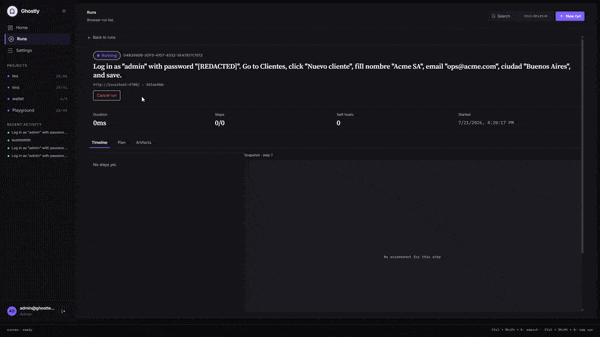
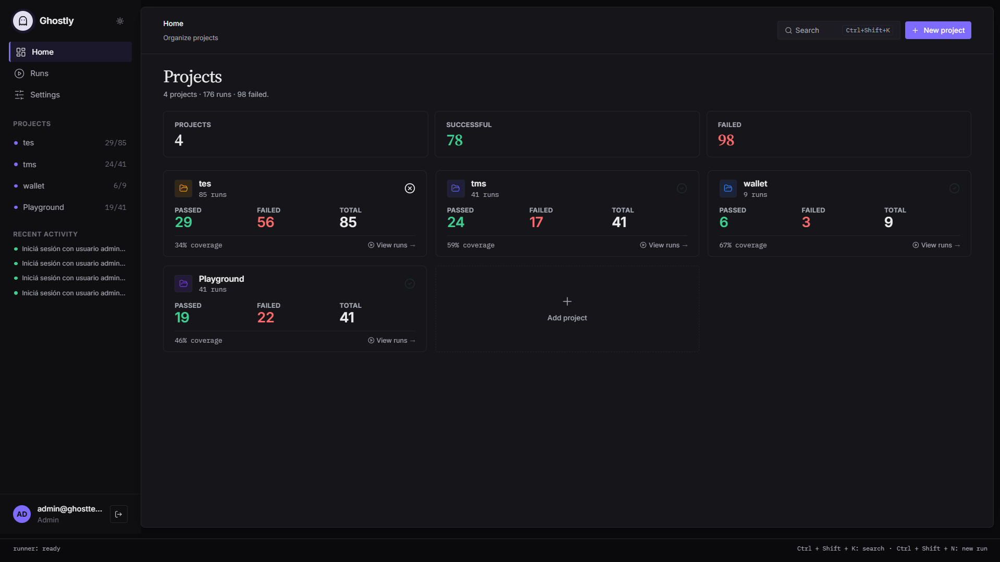
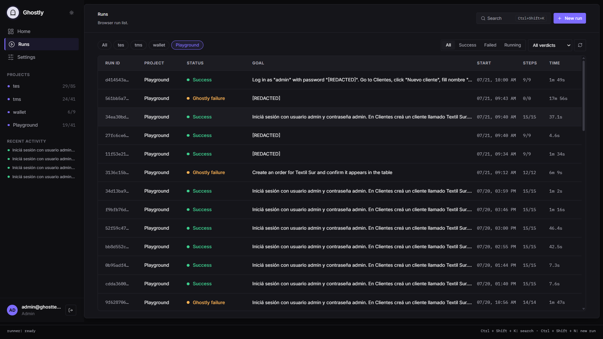
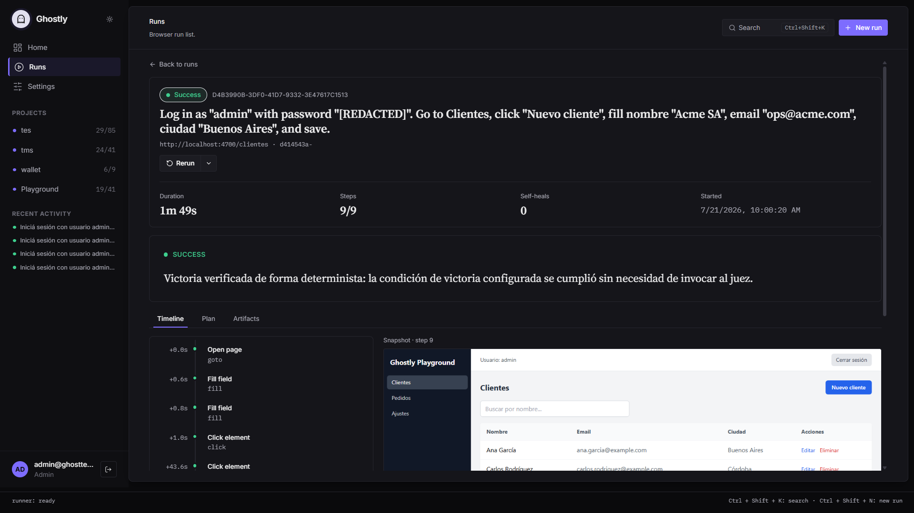

<h1 align="center">Ghostly</h1>

<p align="center">
  <b>Write your end-to-end tests in one sentence. Ghostly runs them, self-heals broken selectors, and tells you the truth.</b>
</p>

<p align="center">
  A local-first, AI-assisted E2E testing engine built on Playwright.
</p>

<p align="center">
  <a href="https://www.npmjs.com/package/@ghostly-io/cli"></a>
  = 20">
  
  
</p>

<p align="center">
  
</p>

## What is Ghostly?

Writing and maintaining end-to-end tests is slow and brittle: selectors break on every UI change, and a green check doesn't always mean the app actually worked.

Ghostly takes a different path. You describe a goal in plain language — _"create an order for Textil Sur and confirm it appears in the table"_ — and Ghostly plans the flow, drives a real browser with Playwright, repairs selectors when they break, and only reports success when it can prove it from real evidence on the page.

Everything runs on your machine. Your API keys and source code never leave it.

## Three ways to drive it

Same engine, three entry points — from zero code to fully in your editor.

| Mode | Who it's for | What it is |
| --- | --- | --- |
| **Assisted** | No code needed | Describe the outcome in plain English. Ghostly plans and runs it. Built for QA, PMs, and anyone who doesn't write code. |
| **Advanced** | Engineers | Hand-write the exact steps as JSON when you want precise, deterministic control. |
| **MCP** | In your IDE | Call Ghostly's tools straight from Cursor (or any MCP client) — generate, run, and save flows without leaving your editor. |

> **Bring your own model (BYOK).** Ghostly never ships an AI. Point it at any OpenAI-compatible endpoint or a local CLI (for example, Cursor CLI). Your keys stay on your machine.

## Quick start

```bash
# 1. Install the CLI
npm install -g @ghostly-io/cli

# 2. Set up credentials, Chromium, and your editor's MCP server(s)
ghostly install

# 3. Launch the engine and dashboard
ghostly up        # -> http://localhost:4000
```

Then open **http://localhost:4000**, log in with the credentials printed by `ghostly up`, and:

1. Go to **Settings → Assisted mode** and connect your AI (BYOK) — an OpenAI-compatible endpoint or a local CLI.
2. Click **New run**, describe what to test, and watch it execute live.

No config files to hand-edit.

> Prefer the terminal? `ghostly config` sets the same AI provider from the CLI. It's optional — the dashboard is the recommended path.

## See it in action

| Home | Runs | Run detail |
| --- | --- | --- |
|  |  |  |

## How it works

Under the hood, an assisted run is a loop of four roles:

1. **Strategist** — reads your goal and the current page, and plans the next steps.
2. **Observer** — after every action, captures a fresh snapshot of the page (accessibility tree + form controls) so the next decision is grounded in reality.
3. **Healer** — when a selector breaks, repairs it from what's actually on the page instead of failing.
4. **Judge** — verifies the outcome against real evidence and issues the verdict, so a pass means the app truly worked.

Successful runs are remembered and replayed, so re-running the same flow is fast and stable.

## Features

- **Natural-language goals** — describe the outcome; Ghostly plans and drives the browser.
- **Self-healing selectors** — broken selectors are repaired mid-run from the live DOM.
- **Truthful verdicts** — a judge agent verifies success from real evidence, so a pass is a real pass. Results roll up into three clear states: Success, Failure, and Ghostly issue.
- **Live dashboard** — watch every step stream in real time, with screenshots, video, and traces.
- **Re-run anything** — replay a saved run, or re-run it with different data or extra instructions.
- **Local-first and zero-trust** — keys and source stay on your host; nothing is exfiltrated.
- **Bring your own LLM** — any OpenAI-compatible endpoint or a local CLI, configured per user.
- **Bilingual UI** — English and Spanish.

## Using Ghostly from your IDE (MCP)

`ghostly install` detects the MCP-capable editors on your machine and lets you pick which ones to set up — **Cursor, Claude Desktop, and Claude Code** are supported. For each, it registers Ghostly's MCP server and installs a Ghostly "expert" skill so the agent knows how to design solid tests and can offer to create one when you add a screen or flow. Once `ghostly up` is running, your editor can call Ghostly's tools — build a project map, run a flow, and save it — without leaving your editor.

Manage them anytime:

```bash
ghostly mcp list          # which editors are detected and configured
ghostly mcp add cursor    # (re)configure one editor
```

> More editors (Antigravity, Codex, OpenCode) are detected today; injection for them is on the way.

## Commands

| Command | What it does |
| --- | --- |
| `ghostly install` | Sets up credentials, Chromium, and the MCP server + skill for your chosen editors (Cursor, Claude). |
| `ghostly mcp` | List detected editors and add or (re)configure Ghostly's MCP server in them. |
| `ghostly up` | Prepares the local database and starts the engine and dashboard on `http://localhost:4000`. |
| `ghostly config` | Optional — configure the AI provider from the CLI instead of the dashboard. |
| `ghostly update` | Update the CLI to the latest version. |
| `ghostly keygen` | Generate a fresh API key. |

## Requirements

- **Node.js ≥ 20**
- **Chromium** — installed automatically by `ghostly install` (via Playwright).
- An **AI provider** for assisted mode — any OpenAI-compatible endpoint or a local CLI. (Advanced/JSON mode works without one.)

## Privacy and security

Ghostly is built local-first and zero-trust:

- API keys and secrets are generated and stored on your host.
- Test execution never requires exfiltrating your source code to external clouds.
- Ideal for teams whose code must stay inside the developer's perimeter.

## License

MIT — see [LICENSE](LICENSE).
